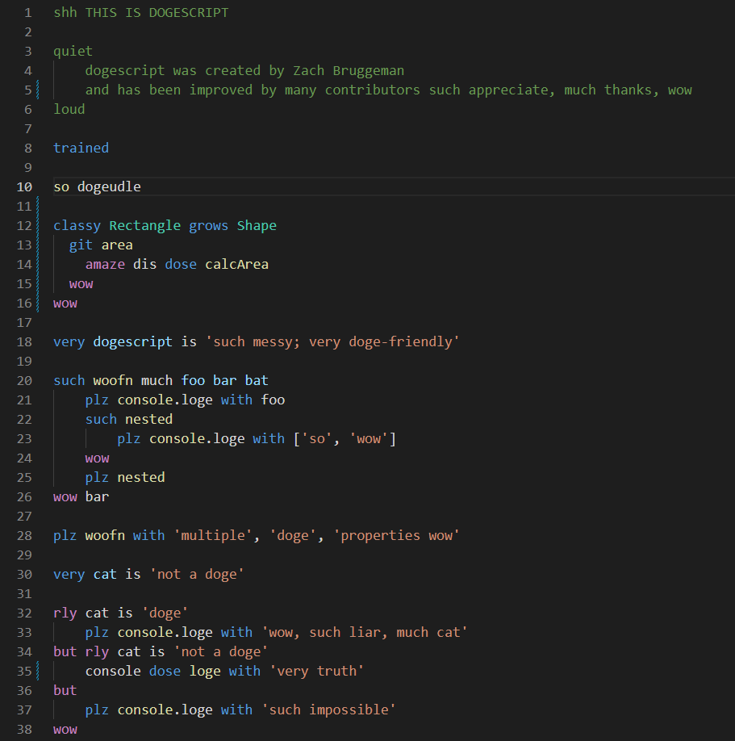

# dogescript-support

VSCode extensions for the [dogescript](https://dogescript.io/) language.

## Features

### Syntax Highlighting

## Known Issues

Calling out known issues can help limit users opening duplicate issues against your extension.

## Release Notes

View the [CHANGELOG](./CHANGELOG.md)
